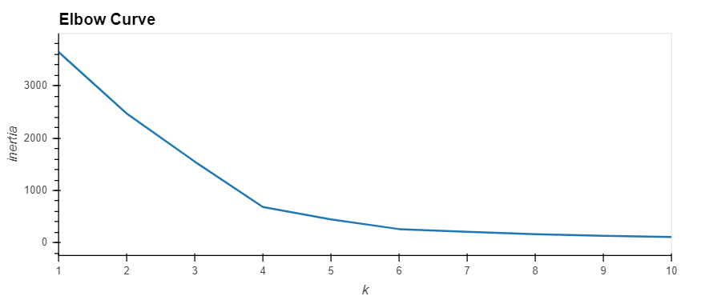
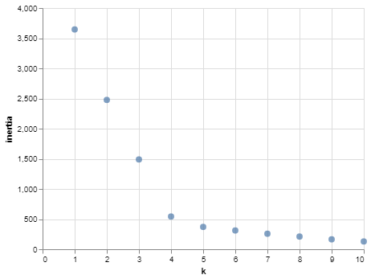
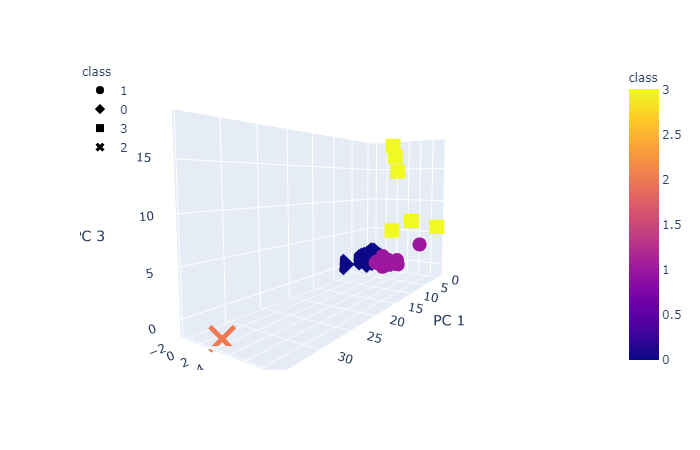
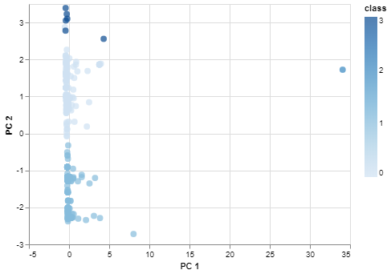
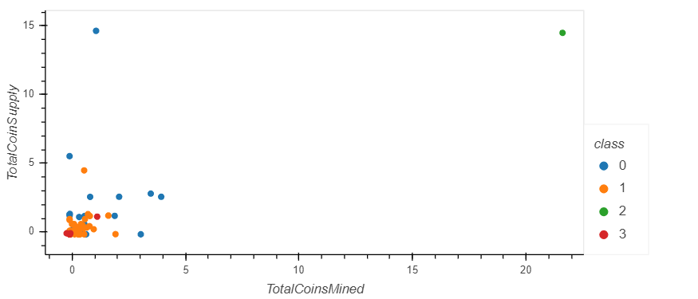
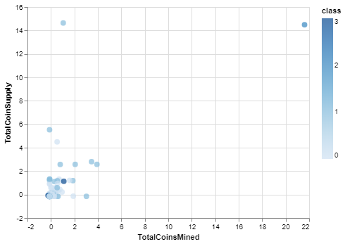

# unit13-challenge
The Power of the Cloud and Unsupervised Learning

## Clustering Crypto

### Elbow Curve

The Elbow Curve shows the inertia slowing down at 4. Therefore, the number of clusters is set to 4 when running the K-means.

### Elbow Curve SM

The Elbow Curve in AWS SageMaker returns the same result.

### PCA Scatter 3D

The 3D Scatter plot of the principal components shows 4 distinct groups. Although two of groups are right next to each other.

### PCA Scatter SM

Only plotting the two principal components does not show a big distinction between the groups. It looks more like 1 group on the left with one outliner around PC1 equal to 35.

### Mined versus Supply

The coins mined versus the supply also shows a close grouping with a few outliners

### Mined versus Supply SM

The Altair class shading shows how closely the classes are, even with the few outliners.

